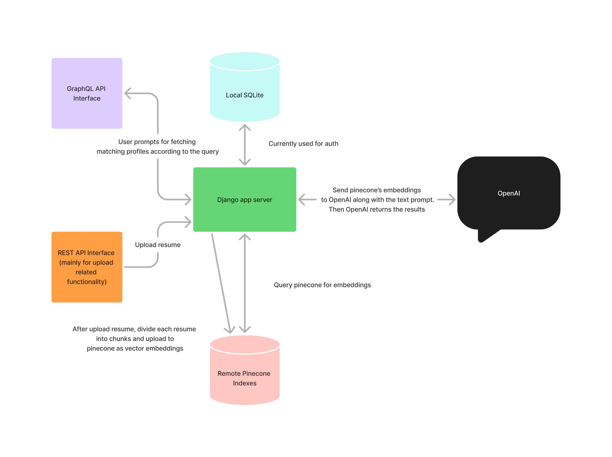

# talent-finder

This app allows users to upload thier resume and allows recruiters to search for
candidates based on their skills and experience according to the recruiter's prompt.

## Installation
1. Clone the repository
2. Create a new virtual environment and then run pip install -r requirements.txt
3. Run the server using python manage.py runserver_plus 0.0.0.0:8000
4. Run the management command `python manage.py gen_app_users --username=your_username --password=your_password --email=your_email` to generate a super user
5. Run the management command `python manage.py gen_base_talent --quantity=your_desired_number` to generate base talents. **Currently these do not contribute to the features implemented. To be Implemented SOON**
6. Open the browser and go to `http://localhost:8000/graphql/` to access the GraphQL API interface
7. To access the admin panel, go to `http://localhost:8000/admin/` and login with the superuser credentials
8. Create a .env file in the root directory and add the following variables
```
OPENAI_TOKEN=
LANGSMITH_TRACING=true
LANGSMITH_ENDPOINT=
LANGSMITH_API_KEY=
LANGSMITH_PROJECT=
OPENAI_API_KEY=

PINECONE_API_KEY=
PINECONE_ENVIRONMENT=

EXEC_ENV=
```

## Features
1. Users can upload their resume
2. Recruiters can search for candidates based on their skills and experience
3. Easily usable GraphQL API interface
4. Inbuilt admin panel (django admin)

## Technologies and Web Frameworks Used
- Django
- Django Rest Framework
- Graphene-Django
- Django-Extensions

## AI based frameworks and libraries used
- OpenAI
- Langchain
- Pinecone

## Architecture


## GraphQL Interface Example
```graphql
query getMatchingResumes {
    matchingResumes(query: "give me a list of all people with atleast 5+ years of experience in Java", topK:5) {
        firstName
        lastName
        relevantSkills
        experiences
        matchPercentage
    } 
}
```
Response:
```json
{
  "data": {
    "matchingResumes": [
      {
        "firstName": "John",
        "lastName": "Carter",
        "relevantSkills": [
          "Java",
          "Spring Boot",
          "Microservices",
          "CI/CD"
        ],
        "experiences": [
          "Architected and developed RESTful APIs using Java 17 and Spring Boot",
          "Led a team to migrate a monolithic application to microservices architecture",
          "Implemented CI/CD pipelines with Jenkins and Docker"
        ],
        "matchPercentage": "90%"
      },
      {
        "firstName": "Cyber",
        "lastName": "Naskar",
        "relevantSkills": [
          "Java",
          "SQL",
          "AWS",
          "Third-Party Integrations"
        ],
        "experiences": [
          "Optimized SQL queries and fixed database bottlenecks",
          "Worked with third-party integrations like Shopify and Klaviyo",
          "Architected and built a garbage collection system for data management"
        ],
        "matchPercentage": "80%"
      }
    ]
  }
}
```

## Contributors
- [Cyber]()